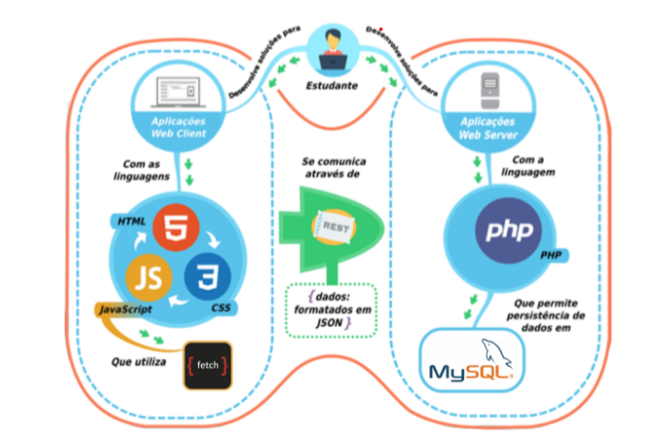

# Programação Web - Bacharelado em Ciência da Computação

  

## Introdução

Este repositório contém todos os exercícios, projetos e anotações desenvolvidos durante a disciplina de **Programação Web**, ofertada pela Escola Politécnica da PUCPR no segundo semestre de 2025.

A disciplina, de natureza prática, introduz o desenvolvimento de sistemas web interativos e responsivos, com comunicação assíncrona entre cliente-servidor e persistência de dados. O objetivo é capacitar o estudante a construir websites modernos, empregando boas práticas e as tecnologias essenciais do front-end.

---

## Conteúdos Abordados

Ao longo do semestre, os seguintes temas de estudo (Study Topics) foram explorados:

- **TE1:** Construção de elementos estáticos de páginas web (HTML).
- **TE2:** Formatação de páginas web (CSS).
- **TE3:** Programação em JavaScript para interatividade.
- **TE4:** Comunicação cliente e servidor.
- **TE5:** Persistência em banco de dados relacional.
- **TE6:** Boas práticas de programação web.

---

## Aulas e Atividades

O conteúdo de cada aula está organizado em branches separadas para isolar os projetos e facilitar a consulta.

> **Nota:** Para visualizar o código de uma aula específica, você pode usar o menu de branches do GitHub (no canto superior esquerdo desta página) ou clonar o repositório e usar o comando `git checkout <nome-da-branch>`.

- **Aula 01: Introdução ao HTML**

  > Fundamentos do HTML, estrutura de documentos, principais tags e criação de formulários.
  > _Branch: `aula-01`_

- **Aula 02: Introdução ao CSS e Estrutura de Branches**

  > Conceitos de CSS, seletores, pseudo-classes e organização de projetos Git com branches por exercício.
  > _Branches: `aula-02-1`, `aula-02-2`_

- **Aula 03: Transição de Páginas na Web**

  > Organização de arquivos em projetos multi-páginas e navegação usando a tag `<a>` (hiperlink).
  > _Branch: `aula-03`_

- **Aula 04: Construção de Cards com `
` e Flexbox**

  > Uso de `divs` como containers e introdução ao Flexbox para criação de layouts responsivos.
  > _Branches: `aula-04-1`, `aula-04-2`_

- **Aula 05: Introdução ao JavaScript**

  > Manipulação do DOM, eventos (`onclick`), funções e lógica para criar páginas interativas.
  > _Branches: `aula-05-1`, `aula-05-2`, `aula-05-3`_

- **Aula 06: Template Strings**
  > Construção dinâmica de HTML com JavaScript usando Template Strings para renderizar dados.
  > _Branch: `aula-06`_

---

**Professor Orientador:** Eduardo Lino

**Repositório desenvolvido por:** [Sérgio Calazans](https://github.com/sergiocalazans)
